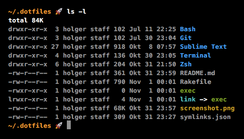

# ~/.dotfiles



## Installation

```
git clone git@github.com:betawax/dotfiles.git ~/.dotfiles
cd ~/.dotfiles
rake install
```

This will link all config files specified in `symlinks.json` relative to the home directory of the current user. If a file already exists, a backup is created. See the `Rakefile` for what is actually happen.

## Homebrew Packages

```
brew install coreutils gnu-sed zsh
brew tap homebrew/dupes; brew install grep
brew install git node composer wp-cli mysql
brew install php71 ruby
```

## NPM Packages

```
npm install -g webpack webpack-cli gulp-cli
```

## Ruby Gems

```
gem install bundler
```
